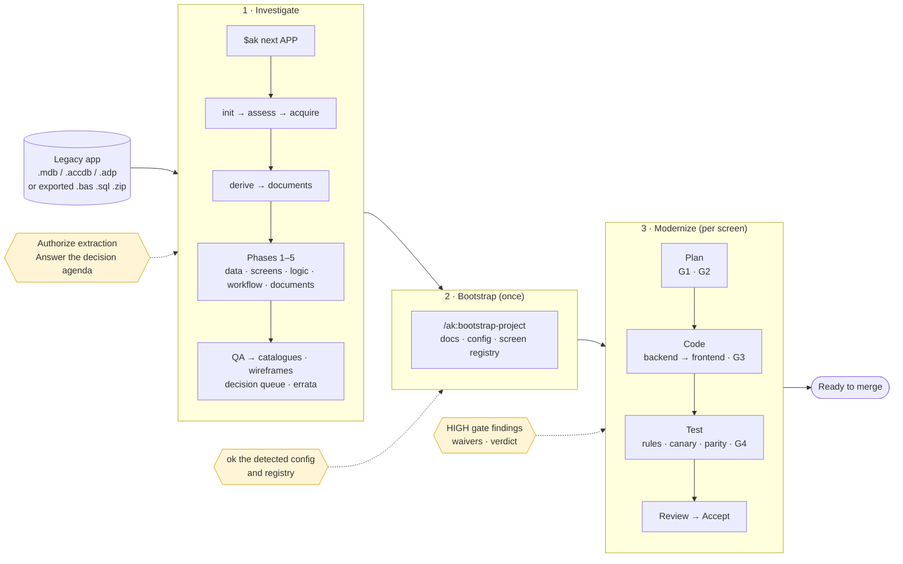
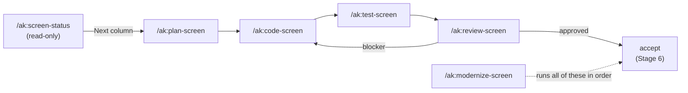

# Access Modernization Kit (AK)

[](LICENSE)
[](https://github.com/tuanvtanrakutei/access-modernization-kit/releases/latest)

An agent plugin that takes a legacy **Microsoft Access / VBA / SQL Server** application to a
working **Django REST + React** implementation. The agent does the reading, extracting,
planning, coding, testing and checking; a person only makes the decisions a machine cannot.

**Machine detects, human decides, agent executes.** Every step below either runs on its own or
stops with one short question — never with a blank page.

---

## How it works



Yellow boxes are the only places a person is asked anything. Everything else is the agent.

---

## Quick start

**1. Install the plugin** — pick your agent:

| Agent | Run |
| :--- | :--- |
| Claude Code | `/plugin marketplace add tuanvtanrakutei/access-modernization-kit` then `/plugin install ak@access-modernization-kit` |
| Codex CLI | `codex plugin marketplace add tuanvtanrakutei/access-modernization-kit --sparse .agents/plugins --sparse plugins/ak` then `codex plugin add ak@access-modernization-kit` |

**2. Install the two Python packages** (the plugin install does not do this):

```bash
pip install "PyYAML>=6.0.3,<7" "jsonschema>=4.26.0,<5"
```

Skipped it? Not a problem: the first `$ak next` notices they are missing and offers to install them.

**3. Point it at your app and let it run:**

```text
$ak init MYAPP --source D:/path/to/exported-sources-or-zip
$ak next MYAPP
```

`$ak next` keeps running the next step until something needs you, then tells you in one line
what it needs. Say `$ak next MYAPP` (or just "continue MYAPP") again after answering.

> Have a live `.mdb` / `.accdb` instead of exports? Use `$ak init MYAPP` without `--source`;
> `$ak next` will ask for the `access_snapshot_extract` authorization before it touches it.
> It never opens the original file — only a hash-verified disposable copy (Windows with
> Microsoft Access or the ACE engine).

**4. When the investigation is published, modernize:**

```text
/ak:bootstrap-project          once — detects your repo's settings, asks you to ok them
/ak:modernize-screen           once per screen — offers the next screen by priority
```

---

## What you decide (the 5%)

| When | The agent asks | You answer |
| :--- | :--- | :--- |
| Extracting from a live database | May I extract from a snapshot copy? | `ok` |
| A phase needs evidence nobody supplied | The exact file or command that would supply it | supply it, or waive with a reason |
| After each phase gate | The decision agenda (`$ak decisions`) — one list per person to ask | `ok` to accept defaults, or override one |
| Bootstrap | Detected config values, each with the file it came from; the seeded screen registry | `ok` / `edit ROW=value` |
| A HIGH gate finding on a screen | The finding and its options | `examine` / `defer` / `cancel` |
| A rule that cannot be tested | Waive it? (your name and date are recorded) | reason + name |
| Review verdict | Approve, or send back | — |

Everything not in this table — extraction, catalogues, plans, code, tests, canaries, parity
checks, docs validation, status — runs without a question.

---

## Day-to-day: one screen



Use **`/ak:modernize-screen`** for the whole thing. Use a single-stage skill to enter in the
middle. Each one ends by naming the next skill and offering to run it, and refuses — with an
offer to run the missing step — when its input is not there yet.

| Skill | Or just say | Does |
| :--- | :--- | :--- |
| `/ak:screen-status` | "where do we stand" | Every screen, its status, and the **next command to paste**. Writes nothing. |
| `/ak:modernize-screen` | "implement screen X", "continue screen X", "implement the next screen" | The full pipeline for one screen, or several in parallel |
| `/ak:plan-screen` | "just plan screen X" | Stages 1–2: scope and screen plan, no code |
| `/ak:code-screen` | "code screen X from its plan" | Stages 3a–3b: backend, then frontend |
| `/ak:test-screen` | "test screen X" | Stages 4a–4b and gate G4: rule tests, canaries, output parity |
| `/ak:review-screen` | "review screen X" | Stage 5: one verdict, every finding with its failing scenario |
| `/ak:bootstrap-project` | "bootstrap a new project for MYAPP" | One-time setup of the project's docs, config and registry |
| `/ak:validate-docs` | "check the docs" | Finds unfilled config, dangling references, broken issue rows. Fixes nothing. |
| `/ak:triage-suite` | "why are 48 tests failing" | Groups failures by cause, against a baseline |

Details: [`plugins/ak/modernize/README.md`](plugins/ak/modernize/README.md).

---

<details>
<summary><b>Investigation commands — full reference</b></summary>

You rarely need these by name: `$ak next <APP_ID>` picks the right one. They are agent
commands, typed into the chat (in Claude Code also reachable as `/ak:investigate`), and plain
language works the same ("initialize a workspace for MYAPP").

Order for one app: `init` → `assess` → `acquire` → `derive` → `documents` → `phase`/`run` →
`citations`/`conformance` → `status` → `render`.

| Command | Action |
| :--- | :--- |
| `$ak next <APP_ID>` | Run the next unfinished step, and keep going until a person is needed. |
| `$ak init <APP_ID> [--source <PATH>]` | Scaffold the app workspace. With `--source` (folder or .zip), discover the artifacts into `manifest.yaml`. |
| `$ak assess <APP_ID>` | Readiness, gaps, required approvals and host checks, before any phase. |
| `$ak acquire <APP_ID>` | Plan and assemble the canonical bundle. |
| `$ak derive --app-root <PATH>` | Derive the relationships the bundle states literally. Once, before Phase 1. |
| `$ak documents --app-root <PATH>` | Normalize XLSX/DOCX/PPTX/PDF into citable UTF-8. Required before Phase 5. |
| `$ak phase <1-5> <APP_ID>` | Run one phase. |
| `$ak run <APP_ID>` | Run every permitted phase in order. |
| `$ak status <APP_ID>` | Investigation status and QA reports. |
| `$ak decisions --app-root <PATH>` | The question list and decision queue: one agenda per person, blocking items first. |
| `$ak errata --app-root <PATH>` | Render every correction to a published claim. |
| `$ak catalogues --app-root <PATH>` | Every table, column, form, report and query, generated from the bundle. |
| `$ak wireframes --app-root <PATH>` | Draw every legacy form on one HTML page. |
| `$ak glossary` / `$ak bilingual` | Propose an English name for every production name; print it beside the original. |
| `$ak meanings --app-root <PATH>` | Tables and columns still needing a business meaning. |
| `$ak interviews --app-root <PATH>` | Where the Q&A register and its pages disagree. |
| `$ak samples --app-root <PATH>` | Supplied samples against their import specification. |
| `$ak completeness --app-root <PATH>` | Whether every object's definition text arrived. |
| `$ak references --app-root <PATH>` | Every source read, with its digest. |
| `$ak citations` / `$ak conformance` | Fail on a citation to a missing evidence id; check a document carries what its phase contract promises. |
| `$ak backfill-needs --app-root <PATH>` | Give open questions the block the decision queue reads. |
| `$ak import-sources --source <DIR>` | Write the manifest an already-exported source tree needs. |
| `$ak clean --app-root <PATH>` | Report what a workspace no longer needs; remove it with `--delete`. |
| `$ak render <APP_ID> [LANG]` | Final deliverables (EN, JA or VI), after QA passes. |
| `$ak help` | This guide. |
| `$ak install claude <PROJECT_PATH>` | Pin the package into one project without the marketplace. Not needed after `/plugin install`. |

Optional document readers for Phase 5, only when your agent has none of its own:
`pip install -r plugins/ak/requirements-documents.txt`.

</details>

<details>
<summary><b>Safety contract</b></summary>

- **Exported sources** (.bas, .cls, .sql, .csv, .zip) need no Microsoft Access.
- **Live extraction** needs Microsoft Access or the ACE engine on Windows; `$ak assess` checks bitness and approvals.
- **The original `.mdb` / `.accdb` is never opened or modified.** Extraction runs only against a byte-for-byte verified disposable snapshot, and only after you authorize it.
- `run` and `next` never authorize live Access, ADP, SQL Server, backup restore or network access.
- Validation skills report and stop; nothing is fixed, formatted or deleted without your `ok`.

</details>

## More

- First investigation, step by step: [docs/first-access-mdb-investigation.md](docs/first-access-mdb-investigation.md)
- The modernization pipeline in detail: [plugins/ak/modernize/README.md](plugins/ak/modernize/README.md)
- [CONTRIBUTING.md](CONTRIBUTING.md) · [SECURITY.md](SECURITY.md) · [CHANGELOG.md](CHANGELOG.md)

Licensed under [Apache License 2.0](LICENSE). Copyright 2026 Vo Ta Tuan.
