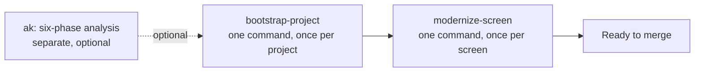

# access-modernize

A reusable Claude Code plugin for **legacy Microsoft Access → Django REST + React** modernization projects.

It drives **one screen at a time** through a fixed pipeline, and enforces coverage gates so that every legacy artifact (form, report, VBA routine, stored procedure) is traceable to implemented code — or explicitly recorded as a known gap.

## Contents

- [At A Glance](#at-a-glance)
- [Command Guide](#command-guide)
- [The Pipeline In Detail](#the-pipeline-in-detail)
- [Bootstrapping A New Project](#bootstrapping-a-new-project)
- [Common Commands](#common-commands)
  - [Single screen, end-to-end](#single-screen-end-to-end)
  - [Single stage](#single-stage)
  - [Multiple screens in parallel](#multiple-screens-in-parallel)
  - [Adding a new screen mid-pipeline](#adding-a-new-screen-mid-pipeline)
- [Stage 0 — Legacy Analysis Integration](#stage-0-legacy-analysis-integration)
- [What Problem This Solves](#what-problem-this-solves)
- [Which Files Are For You, Which Are For The Agent](#which-files-are-for-you-which-are-for-the-agent)
- [Design Layers](#design-layers)
- [Installation](#installation)
- [What This Pipeline Ships](#what-this-pipeline-ships)
- [Scope Boundaries](#scope-boundaries)
- [Reusing Across Projects](#reusing-across-projects)

## At A Glance



Two commands cover the whole pipeline end to end: bootstrap once per project, then run the
per-screen pipeline once per screen. Everything inside each command is automatic except the
one manual step named under "Bootstrapping A New Project" below.

## Command Guide

Not covered by the repository root README — that one documents `$ak`'s own six-phase
commands only, a separate, optional upstream step (see "At A Glance" above).

Confirmed against a real Claude Code install: all nine entries below appear in the `/`
slash-command picker as `/ak:<name>`. Pick one there, or, for the four skills, describe the
same request in plain language instead — both trigger the same skill.

**The four skills — slash command, or natural language:**

| Skill | Slash (Claude Code) | Or say something like ... |
| :--- | :--- | :--- |
| `bootstrap-project` | `/ak:bootstrap-project` | "Bootstrap a new project for {app}" |
| `modernize-screen` | `/ak:modernize-screen` | "Implement screen {screen}" |
| `validate-docs` | `/ak:validate-docs` | "Validate the docs" / "check the docs set" |
| `triage-suite` | `/ak:triage-suite` | "Why are 48 tests failing" / "triage the test suite" |

**The five per-stage commands — slash only, no natural-language shortcut:**
`/ak:plan-screen`, `/ak:code-screen`, `/ak:test-screen`, `/ak:review-screen`,
`/ak:screen-status` (Claude Code only for now — see [Installation](#installation)).
Example: `/ak:plan-screen OrderEntry` runs Stages 1–2 for the `OrderEntry` screen. What
each stops on, and what it refuses without: [Single stage](#single-stage) below — not
repeated here to avoid two copies going stale against each other.

## The Pipeline In Detail

What `modernize-screen` runs for one screen — the "At A Glance" diagram's `M` box, expanded:

```mermaid
flowchart LR
    S0["Stage 0<br/>Legacy Analysis<br/>(external, optional)"] --> S1["Stage 1<br/>Business flow"]
    S1 --> G1{{"G1<br/>Evidence"}}
    G1 --> S2["Stage 2<br/>Screen plan<br/>(BE + FE contract)"]
    S2 --> G2{{"G2<br/>Rules"}}
    G2 --> S3a["Stage 3a<br/>Backend coding"]
    S3a --> S3b["Stage 3b<br/>Frontend coding"]
    S3b --> G3{{"G3<br/>API + UI"}}
    G3 --> S4a["Stage 4a<br/>Backend test"]
    S4a --> S4b["Stage 4b<br/>Frontend test"]
    S4b --> S5["Stage 5<br/>Review"]
    S5 -->|blocker| S3a
    S5 -->|approved| S6["Stage 6<br/>Final Acceptance"]
    S6 -->|accepted| DONE["Ready to merge"]
```



Full stage definitions, gates, run modes, and failure handling are in `docs/MASTER_WORKFLOW.md`. Read that file before running the pipeline.

## Bootstrapping A New Project

One command:

```text
Bootstrap a new project for {app}
```

(or invoke the `bootstrap-project` skill directly). What it does, in order:

| Step | What happens |
|---|---|
| 1. Collect inputs | Asks for `{{DOCS_DIR}}`, `AK_RUN_DIR`, `PROJECT_NAME`, `SUBSYSTEM_CODE`, `LEGACY_VARIANT` |
| 2. Copy templates | Every template, every per-screen folder |
| 3. Seed the registry | If Phase 2 is `PUBLISHED`: detects `Screens_Registry.md` rows, one `ok`/`cancel` for the whole table |
| 4. Wire `CLAUDE.md` / `AGENTS.md` | Created if missing, or updated in place — one more `ok`/`cancel`, so a fresh session already knows where the pipeline lives |

**The one manual step:** fill every remaining `{{...}}` value in `PROJECT_CONFIG.md`. An
unfilled placeholder makes the agent stop and ask, rather than guess a path. Nothing else
here is done by hand — not the folders, not the per-folder `README.md`s, not the registry,
not the `CLAUDE.md`/`AGENTS.md` pointer.

**No `AK_RUN_DIR` yet?** Run `$ak run <APP_ID>` first — documented in `ak`'s own top-level
`README.md`, a separate command, not part of this one. Or skip it: bootstrap still works
with `AK_RUN_DIR: n/a`. The registry then stays the template's empty skeleton, and rows get
added by hand or via Agent-Assisted Registration, per screen, later.

## Common Commands

These apply once a project is bootstrapped (`PROJECT_CONFIG.md` filled, `Screens_Registry.md`
seeded). They are also documented, verbatim, in the target repo's own `{{DOCS_DIR}}/README.md`
once bootstrap copies `templates/DOCS_README.md` there — this copy exists so you don't have to
bootstrap a project just to see what running it looks like.

### Single screen, end-to-end

Invoke the `modernize-screen` skill, or describe the goal directly:

```text
Implement screen 受注一覧
```

The agent reads `MASTER_WORKFLOW.md`, runs Pre-Flight, resolves `doc_mode`/`be_mode`/`fe_mode`,
and executes whichever stages each mode calls for.

### Single stage

| Command | Stages | Refuses without |
|---|---|---|
| `/plan-screen {screen}` | 1–2, documents only | (nothing upstream to check beyond evidence) |
| `/code-screen {screen} [--backend-only\|--frontend-only]` | 3a–3b | a two-contract screen plan with a populated gap matrix |
| `/test-screen {screen} [--backend-only\|--frontend-only]` | 4a–4b | a coding record for the track being tested |
| `/review-screen {screen}` | 5 | (reviews whatever upstream artifacts exist, and says what's missing) |
| `/screen-status {screen\|all}` | none — read-only | nothing; always safe to run |

### Multiple screens in parallel

```text
Implement 受注一覧 and 出荷実績表 in parallel
```

The agent partitions by `module` (`orchestration/parallelism.json`), dispatches one group
agent per module group with an envelope from `templates/group-task-envelope.json`, and
aggregates the per-screen handoffs. See `MASTER_WORKFLOW.md` §"Multi-Screen Batch".

### Adding a new screen mid-pipeline

You do not need to edit `Screens_Registry.md` by hand for a screen that already has phase
output. Just ask the agent to work on it directly, and it runs **Agent-Assisted
Registration**: detects `screen_key`, `module`, priority, and status from evidence and code,
then proposes a row and waits for one of:

- `ok` — write it as proposed
- `edit field=value` — apply, re-propose, wait again
- `cancel` — write nothing

Full flow: `MASTER_WORKFLOW.md` §"Agent-Assisted Registration". Think of it as the per-screen
counterpart to `bootstrap-project` — same ritual, run once in bulk there, on demand here.

## Stage 0 — Legacy Analysis Integration

Stage 0 is **outside this plugin**. It is the seam where a legacy-analysis tool (Access extraction, screen inventory, dependency mapping) hands off to this pipeline.

The pipeline consumes whatever Stage 0 produces, as long as it satisfies the **input contract** in `docs/LEGACY_EVIDENCE.md` §"Stage 0 Handoff Contract". If you have no analysis tooling yet, export evidence manually — the contract is the same either way, so swapping in tooling later requires no pipeline change.

If Stage 0 was `ak`'s own six-phase analysis and you haven't read that kind of output before,
start with `docs/PHASE_OUTPUT_GUIDE.md` — a quick-reference for what each phase document
answers and the order worth reading them in — before opening `LEGACY_EVIDENCE.md` §6.1–6.4
for the exact mechanics of what this pipeline consumes.

## What Problem This Solves

Access modernization projects fail in a predictable way: a developer reads part of a legacy form, implements what they saw, and nobody notices the three event handlers they never opened. The defect surfaces in UAT months later, when the original context is gone.

This plugin makes that failure mode visible **between stages**, while the context is still fresh and the rework is cheap.

## Which Files Are For You, Which Are For The Agent

| | Files | Read these when ... |
|---|---|---|
| **You read** | This `README.md`, `docs/PHASE_OUTPUT_GUIDE.md`, the target repo's own `{{DOCS_DIR}}/README.md` | you want to understand what's happening, or find where something lives |
| **The agent reads** | `docs/MASTER_WORKFLOW.md`, `TRACEBACK_GATES.md`, `LEGACY_EVIDENCE.md`, `*_CODING.md`, `*_TESTING.md`, `CONVENTIONS.md`, every `skills/*/SKILL.md` and `commands/*.md`, `orchestration/*.json` | you're debugging *why* the agent stopped or what a gate checked — not for a first read |

The agent-facing set is exhaustive and rule-precise on purpose — that precision is what the
coverage gates depend on. It reads like a spec because it is one. Start with the files in the
first row; drop into the second row only when you need the exact rule behind a decision.

## Design Layers

The plugin separates three concerns that are usually tangled together in project documentation:

| Layer | What it is | Where it lives | Changes per project? |
|---|---|---|---|
| **L1 — Universal** | Pipeline shape, run modes, coverage gates, severity ladder, registry + issue-log patterns, parallelism, abort/cleanup | `docs/MASTER_WORKFLOW.md`, `docs/TRACEBACK_GATES.md` | No |
| **L2 — Access family** | Evidence taxonomy per legacy variant, extraction tooling, encoding rules, what maps to what | `docs/LEGACY_EVIDENCE.md` | Only by legacy variant |
| **L3 — Project instance** | Names, paths, module list, API prefix, commands, conventions, screen inventory | `PROJECT_CONFIG.md` in the target repo | Every project |

Generic documents reference L3 values as `{{PLACEHOLDER}}`. The agent resolves them by reading `PROJECT_CONFIG.md` at pre-flight. **Never hard-code a project value into an L1 or L2 document.**

## Installation

Nothing separate to install — ships inside `ak`. See the
[repository root README](../../../README.md) to install, and
[`references/agent-compatibility.md`](../references/agent-compatibility.md) for cross-runtime
mechanics.

Installing `ak` is not the same as setting up a project to modernize: it gives you the method
and tooling, but a target repository still needs the bootstrap above.

## What This Pipeline Ships

```
plugins/ak/
├── skills/                         ← shared with the six-phase side; every skill discoverable by both CLIs
│   ├── ak/                         ← the six-phase investigation skill, unchanged
│   ├── bootstrap-project/          ← one-time project setup, seeds the registry when phase output exists
│   ├── modernize-screen/           ← the full pipeline, the usual entry point
│   ├── validate-docs/              ← check a bootstrapped project's documents
│   └── triage-suite/               ← work out why a suite is red
├── commands/                       ← per-stage entry points for mid-pipeline work (Codex support declared, unconfirmed)
│   ├── plan-screen.md              ← Stages 1–2, documents only
│   ├── code-screen.md              ← Stages 3a–3b
│   ├── test-screen.md              ← Stages 4a–4b
│   ├── review-screen.md            ← Stage 5
│   └── screen-status.md            ← read-only, writes nothing
├── hooks/                          ← a sensor, never an actor (Codex support declared, unconfirmed)
│   ├── hooks.json
│   └── scope_sensor.py             ← warns on parent-owned files and over-long lines
└── modernize/
    ├── docs/                       ← L1 + L2 reference documents, no project values
    │   ├── MASTER_WORKFLOW.md      ← the orchestrator
    │   ├── TRACEBACK_GATES.md      ← coverage gate specification
    │   ├── LEGACY_EVIDENCE.md      ← Access variant evidence taxonomy, Stage 0 handoff contract
    │   ├── PHASE_OUTPUT_GUIDE.md   ← how to read a six-phase run's output, oriented for humans
    │   ├── BACKEND_CODING.md       ← Stage 3a rules
    │   ├── FRONTEND_CODING.md      ← Stage 3b rules, incl. legacy UI parity
    │   ├── BACKEND_TESTING.md      ← Stage 4a method
    │   ├── FRONTEND_TESTING.md     ← Stage 4b method
    │   └── CONVENTIONS.md          ← language-level style
    ├── orchestration/              ← how a multi-screen run is dispatched
    │   ├── roles.json               ← who may write what, and who may prompt the user
    │   └── parallelism.json         ← the parallelism rules as data, not prose
    ├── templates/                  ← copied into the target repo at bootstrap
    │   ├── PROJECT_CONFIG.md        ← the only file you must author by hand
    │   ├── ARCHITECTURE.md
    │   ├── Screens_Registry.md
    │   ├── Known_Issues.md
    │   ├── Known_Issues_Archive.md  ← starts empty; Known_Issues.md's Archive Policy fills it
    │   ├── DOCS_README.md           ← becomes the target repo's {{DOCS_DIR}}/README.md
    │   ├── {Business_flows,Screen_plans,Coding_Records}_README.md
    │   ├── {Test_Instruction,Code_Review,Final_Acceptance}_README.md
    │   ├── FRONTEND_API_PATTERNS_TEMPLATE.md   ← starting point for {{FE_PATTERN_DOCS}}, not auto-copied
    │   ├── FRONTEND_UI_PATTERNS_TEMPLATE.md    ← same; both fill-in-the-blank, generalized from a real project
    │   ├── group-task-envelope.json ← one per module group; write_paths is the agent's scope
    │   └── group-agent-prompt.md    ← the group agent's standing instructions
    └── scripts/
        ├── validate_docs.py         ← reports documentation defects, never repairs
        ├── triage_suite.py          ← groups failing tests by cause, runs nothing
        └── scan_phase2_inventory.py ← detects Screens_Registry rows from a Phase 2 doc, never writes them
```

Skills, commands, and hooks sit at the plugin root, not nested under `modernize/`. That is
where both CLIs already look: Claude Code's default folder scan, and Codex CLI's single fixed
`./skills/` path (`plugins/ak/.codex-plugin/plugin.json`, enforced by
`plugins/ak/scripts/validate_structure.py`).

Everything else a skill references — templates, scripts, coding-rule documents — stays under
`modernize/`. Each skill addresses it via `${CLAUDE_PLUGIN_ROOT}/modernize/...`, a path
anchored to the plugin root, not to wherever the skill file itself happens to sit.

`bootstrap-project` copies each `*_README.md` template to its matching per-screen folder as
`README.md` — `templates/Screen_plans_README.md` becomes `{{DOCS_DIR}}/Screen_plans/README.md`,
and so on. Nothing here is copied by hand.

Two design rules run through all of it, and both exist because the opposite caused real
damage here: **the machine detects, the human decides, the agent executes** — so the hook and
both scripts report and never write; and **an agent's write scope is data the parent
controls**, declared as `write_paths` in a task envelope rather than a paragraph the agent
has to remember.

## Scope Boundaries

**In scope**: per-screen backend implementation, per-screen frontend implementation, tests for both, review gate, coverage traceability, documentation artifacts.

**Out of scope**: merge governance and post-merge verification (a green Stage 5 means *ready to merge*, not *merged*); infrastructure and deployment; legacy database synchronization; cross-screen refactors; encoding conversion of source files (assumed done upstream or handled per `docs/LEGACY_EVIDENCE.md`).

## Reusing Across Projects

Once `PROJECT_CONFIG.md` is filled, the same plugin drives any Access-family modernization on the fixed target stack (Django + DRF + PostgreSQL backend, React SPA frontend). Adopting a different target stack would require replacing the coding-rule documents; the pipeline, gates, and run modes are stack-independent and stay as-is.
