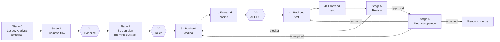

# Master Workflow — Modernize One Screen End-To-End

> **Layer 1 document.** Project-independent. Every project-specific value appears as `{{PLACEHOLDER}}` and is resolved by reading `PROJECT_CONFIG.md` at pre-flight. Never hard-code a project value into this file.

This document is the orchestrator for turning legacy Access evidence into a reviewed backend and frontend implementation of one screen.

When the user asks to implement a screen, the agent reads this file, resolves placeholders from `PROJECT_CONFIG.md`, and runs the stages below in order with coverage gates between them.

## Contents

- [The Pipeline](#the-pipeline)
- [Stage 0 — Legacy Analysis (External To This Pipeline)](#stage-0-legacy-analysis-external-to-this-pipeline)
- [Run Modes](#run-modes)
  - [Backfill Rules](#backfill-rules)
- [Pre-Flight Check](#pre-flight-check)
  - [Concurrent Activity Soft-Lock](#concurrent-activity-soft-lock)
  - [Agent-Assisted Registration](#agent-assisted-registration)
- [Parallelism Rules](#parallelism-rules)
  - [Rule 1 — Batch independent reads within a stage](#rule-1-batch-independent-reads-within-a-stage)
  - [Rule 2 — Do not parallelize across stages within one screen](#rule-2-do-not-parallelize-across-stages-within-one-screen)
  - [Rule 3 — Parallelize across screens only when modules differ](#rule-3-parallelize-across-screens-only-when-modules-differ)
  - [Rule 4 — Sub-task parallelism inside stages 4 and 5](#rule-4-sub-task-parallelism-inside-stages-4-and-5)
- [Update Gates For Registry And Issue Log](#update-gates-for-registry-and-issue-log)
- [Traceback Gates](#traceback-gates)
- [Master Agent Prompt](#master-agent-prompt)
- [How To Invoke](#how-to-invoke)
- [Multi-Screen Batch](#multi-screen-batch)
- [Stage Inputs And Outputs](#stage-inputs-and-outputs)
- [Failure Handling](#failure-handling)
- [Idempotency](#idempotency)
- [Loop Handling](#loop-handling)
- [Abort And Cleanup](#abort-and-cleanup)
- [Cross-Subsystem Model Coordination](#cross-subsystem-model-coordination)
- [Scope Boundaries](#scope-boundaries)
- [Folder Map](#folder-map)

## The Pipeline



| Stage | Owner folder | Output artifact | Closing gate |
|---|---|---|---|
| 0. Legacy analysis | evidence dirs | populated evidence, optional screen inventory | Evidence sufficiency rule (`LEGACY_EVIDENCE.md` §7) |
| 1. Business flow | `Business_flows/` | `Business_flows/{screen}.md` | **G1 Evidence Coverage** + structure valid, reviewer-readable |
| 2. Screen plan | `Screen_plans/` | `Screen_plans/{screen}.md` (backend **and** frontend contract) | **G2 Rule Coverage** + both contracts defined, gap matrix populated |
| 3a. Backend coding | `Coding_Records/` + `{{BACKEND_ROOT}}` | code + `Coding_Records/{screen}.md` §Backend | `{{LINT_CMD}}` passes |
| 3b. Frontend coding | `Coding_Records/` + `{{FRONTEND_ROOT}}` | code + `Coding_Records/{screen}.md` §Frontend | `{{FE_LINT_CMD}}` passes |
| — | — | — | **G3 Implementation Coverage** (API + UI) |
| 4a. Backend test | `Test_Instruction/` | `Test_Instruction/{screen}.md` §Backend + test run | Backend tests green, or blocker recorded with rerun command |
| 4b. Frontend test | `Test_Instruction/` | `Test_Instruction/{screen}.md` §Frontend + E2E run | Frontend tests green, or blocker recorded with rerun command |
| 5. Review | `Code_Review/` | `Code_Review/{screen}.md` | Verdict `approved` or `approved with follow-ups`; traceability rows closed |
| 6. Final acceptance | `Final_Acceptance/` | `Final_Acceptance/{screen}.md` | Recommendation `approve` or `approve with follow-ups`, and `User decision: accepted` |
| — (any stage) | `Bug_Reports/` | `Bug_Reports/{screen}.md` | No gate — filed the moment a single-screen defect is found; an open High-severity entry is a Stage 5 finding |

**Test runs before review** — a reviewer needs test evidence to judge legacy parity. Reviewing on red tests is not reviewing.

**Review is separate from acceptance.** Stage 5 answers "is this correct?"; Stage 6 answers "do we take it?" Those questions have different owners, and merging them produces a reviewer who either rubber-stamps business risk or blocks sound code over a business preference. Stage 6 is a decision gate, not a second technical pass — see `Final_Acceptance/README.md`.

**Coverage gates** catch drift between stages. Full specification in `TRACEBACK_GATES.md`.

## Stage 0 — Legacy Analysis (External To This Pipeline)

Stage 0 is not performed by **this pipeline** — Stages 1-6 below never run extraction, and running
them is always the user's own, separate decision from running Stage 0. It ships in the same
package as the six-phase investigation (`ak`), and the two are **independently invokable**:
running the six phases does not automatically continue into Stage 1, and this pipeline never
triggers Stage 0 on its own. Manual export, per `LEGACY_EVIDENCE.md`, remains equally valid — the
handoff contract below does not assume `ak` produced the evidence.

The pipeline consumes whatever Stage 0 produced, provided it satisfies the handoff contract in `LEGACY_EVIDENCE.md` §6: files present in the declared evidence directories, anchorable by line or page, matchable to a screen, encoding known. `LEGACY_EVIDENCE.md` §6.1 describes the enriched form this contract takes when `ak`'s six-phase output is the producer.

At pre-flight the agent verifies the contract is satisfied for the target screen. It does **not** attempt extraction itself, and does not check whether Stage 0 has been run recently or at all beyond what the contract requires — that determination belongs to whoever decided to start Stage 1. If evidence is missing, it stops and reports which objects are absent.

## Run Modes

A screen has **two independent implementation tracks** — backend and frontend — and they are frequently at different maturity. Mode is therefore resolved per track, not per screen.

| Mode | Trigger | What the coding stage does |
|---|---|---|
| **Greenfield** | Track status is `not_started` | Write new code |
| **Backfill** | Track status is `implemented` or `partial` — code exists but this pipeline has not verified it | **Document existing code only.** Do not write new code unless the user explicitly asks. |
| **Refresh** | Track status is `verified` and the user asked to refresh | Reconcile each artifact against current code; rewrite only what is stale |

Status drives the mode directly, which is why the registry distinguishes `implemented` (code exists, unverified) from `verified` (Stage 5 approved). See `Screens_Registry.md` §Status Vocabulary.

Three modes are resolved at pre-flight:

- `doc_mode` — governs Stages 1 and 2. Derived from whether `Business_flows/{screen}.md` and `Screen_plans/{screen}.md` exist and are current.
- `be_mode` — governs Stages 3a and 4a. Derived from `status_be` in `Screens_Registry.md` plus presence of `Coding_Records/{screen}.md` §Backend.
- `fe_mode` — governs Stages 3b and 4b. Derived from `status_fe` plus presence of §Frontend.

Two real states worth naming. `be_mode: Backfill, fe_mode: Greenfield` — backend shipped earlier, frontend not started. `be_mode: Refresh, fe_mode: Backfill` — backend already verified by this pipeline while the frontend has code that has never been gated, which is the normal state when frontend work is brought into scope after the backend. The agent announces all three modes in one line before Stage 1.

### Backfill Rules

- Stage 3a and 3b produce **documentation of existing code**, not new code. If the stage produces code changes without an explicit user request, reject them and re-run the stage as document-only.
- If a lint command fails on files **not touched in this change**, record it in `Known_Issues.md` as a tooling issue rather than blocking the stage. The Stage 5 reviewer decides merge impact.
- G3 in Backfill is usually a no-op for the affected track, because the code already exists. That is expected, not a sign the gate did nothing.

## Pre-Flight Check

Run once per screen, before Stage 1. These reads are independent — batch them into a single tool-call message.

1. **Read `PROJECT_CONFIG.md`** and resolve every placeholder used below. If any required value is an unfilled `{{...}}`, stop and ask the user to complete it.
2. **Look up the screen in `Screens_Registry.md`.** Resolve `screen_key`, `module`, url segment, `status_be`, `status_fe`.
   - Row exists under active screens → use as-is.
   - Row exists under future scope → promote it to active, statuses stay `not_started`.
   - Row absent → run **Agent-Assisted Registration** below.
3. **Determine `doc_mode`, `be_mode`, `fe_mode`** and announce them.
4. **Grep `Known_Issues.md`** for the screen name and module. List every row with status `open` or `in_progress`. Pay particular attention to `traceability` rows from prior gate runs — they affect coverage decisions in this run. If any row is a blocker, stop and ask.
5. **Verify evidence.** If `{{AK_RUN_DIR}}` is not `n/a`, read `{{AK_RUN_DIR}}/run-state.json` → `phase_gates` for this screen's module before judging anything by hand:
   - Any of phase2/phase4/phase6 is `PENDING` or `REJECTED` for this screen → stop. Stage 1 needs the phase output, not a work-in-progress or rejected one.
   - All relevant phases are `PUBLISHED` → proceed. If the enriched artifacts (`Evidence.json`, `TraceabilityMatrix.csv`, `<bundle_id>/phase-readiness.json`, `<bundle_id>/coverage.json`) are present, prefer them per `LEGACY_EVIDENCE.md` §6.1; if only `phase_gates` is present, that alone satisfies this step.
   - State in the pre-flight announcement which tier was used — `phase_gates` only, or enriched. A screen that silently used the weaker signal must not read the same as one that used the stronger.

   If `{{AK_RUN_DIR}}` is `n/a`, Stage 0 was manual export: verify per `LEGACY_EVIDENCE.md` for `{{LEGACY_VARIANT}}` — at minimum the sufficiency rule in §7.
6. **Verify the table mapping** at `{{TABLE_MAP_DOC}}` covers the tables and fields this screen needs. If not, stop and ask for it to be extended.
7. **Re-read the coding rule documents** — `{{BACKEND_RULES_DOC}}`, `{{FRONTEND_RULES_DOC}}`, `{{CONVENTIONS_DOC}}` — before any coding stage.

### Concurrent Activity Soft-Lock

Before the first write in Stage 3a or 3b, check whether a human or another agent is working on the same area. There is no true lock; this is a git-activity check.

```bash
git log --since="24 hours ago" --name-only -- {{BACKEND_ROOT}}
git status --short {{BACKEND_ROOT}}
```

| Signal | Action |
|---|---|
| No recent commits, working tree clean for the target path | Proceed |
| Uncommitted changes exist under the target path | Stop. Report the dirty paths. Ask whether to abort, stash, or include that work |
| Recent commits by another author | Warn with the commit list, note the latest SHA for cleanup, ask for confirmation |
| Another batch run is active on the same module | Stop. The parent agent should have queued this; coordinate manually |

Repeat the check with `{{FRONTEND_ROOT}}` before Stage 3b.

### Agent-Assisted Registration

When the requested screen is not in `Screens_Registry.md`, do not halt with a bare request for manual entry. Detect, propose, wait.

**Step 1 — Detect.** Derive each field from evidence:

| Field | Detection source |
|---|---|
| `screen` | The name the user typed; verify against an exported object name or a future-scope entry |
| `screen_key` | Convert the legacy object name to `{{SCREEN_KEY_CASE}}`, following existing sibling conventions |
| `module` | Grep `{{BACKEND_ROOT}}` for related endpoints or class names; otherwise infer from the screen's business domain and the module table in `PROJECT_CONFIG.md` §3 |
| url segment | Existing route if present; otherwise propose one derived from `screen_key` and mark it unrouted |
| `priority` | Next integer after the highest existing priority, unless a future-scope row already assigns one |
| `status_be` / `status_fe` | `implemented` if code referencing the screen already exists on that side; otherwise `not_started` |

Flag any field where detection was inconclusive as pending user choice.

**Step 2 — Propose.** Print the proposed row as plain text and wait. Offer exactly three replies: `ok` (write it and continue), `edit field=value ...` (apply, re-propose, wait again), `cancel` (abort with no writes).

**Step 3 — Apply.** On `ok`, insert the row sorted by priority, echo the one-line diff, and continue from pre-flight step 3.

This flow never writes a registry row without an explicit `ok`. Scope decisions stay with the user; detection is the agent's job.

## Parallelism Rules

Stages are sequential because each consumes the previous artifact. Parallelism is allowed in specific, bounded places.

### Rule 1 — Batch independent reads within a stage

| Stage | Batchable reads |
|---|---|
| Pre-flight | `PROJECT_CONFIG.md`; registry row; `Known_Issues.md` grep; evidence directory listings; table mapping; coding rule documents |
| 1 | Legacy form/report exports, screenshots, output samples, prior business-flow artifact |
| 2 | Prior screen plan, current backend sources, current frontend sources, table mapping, Stage 1 output |
| 5 | All upstream artifacts plus the code files cited in the coding record |

Writes are never batched. Any call depending on a prior result runs sequentially.

### Rule 2 — Do not parallelize across stages within one screen

Stage 2 anchors on Stage 1's structure. Stage 3b codes against the contract Stage 2 froze. Stage 4a needs Stage 3a's code. Stage 4b needs a running backend, therefore Stage 4a first. Stage 5 needs test evidence. None of these pairs may overlap.

**Exception:** 3a and 3b may run concurrently **only** when the Stage 2 backend contract is explicitly marked frozen in the screen plan. The frontend then codes against the documented contract, not against a running server. If the backend implementation later deviates from the frozen contract, that deviation is a Stage 5 blocker, not a frontend defect.

### Rule 3 — Parallelize across screens only when modules differ

| Composition | Parallel? | Why |
|---|---|---|
| Different `module` values | Yes | Code lands in different directories; no shared file |
| Same `module`, different url prefix | No | Still shares tests, services, and module-level files |
| Same `module` and prefix | No | Shares routing and serializers |

Partition the requested set into module groups, run one background agent per group, and keep screens within a group sequential.

Frontend files are a second axis: if two screens share a frontend layout, route group, or store, treat them as same-module for partitioning even when their backend modules differ.

### Rule 4 — Sub-task parallelism inside stages 4 and 5

Within Stage 4a, independent test suites may run concurrently. Within Stage 5, evidence reads for the checklist groups may be batched; findings and verdict are written sequentially afterwards.

## Update Gates For Registry And Issue Log

`Screens_Registry.md` and `Known_Issues.md` go stale within a few changes unless writes are tied to pipeline events. These are the only permitted write moments.

| Gate | When | Writes |
|---|---|---|
| **1 — Pre-flight** | Pipeline starts on a future-scope row | Promote row to active; statuses unchanged |
| **2 — Coding stage end** | After 3a and after 3b, once the coding record is written | Track status → `implemented`, or `partial` / `blocked` when applicable; promote cross-screen findings to `Known_Issues.md`; open a row per blocking question |
| **3 — Review verdict** | After the Stage 5 verdict | On `approved`: set `status_be` and/or `status_fe` → `verified` for the tracks this change covered. Open rows for systemic follow-ups. Close issue rows this change resolved. On `changes requested`: change nothing |
| **4 — Abort** | Pipeline halts on a blocker | Track status → `blocked` when screen-level; open an issue row when the cause is cross-screen |

Coverage gates G1/G2/G3 also write `traceability` rows — see `TRACEBACK_GATES.md`.

**Forbidden:** changing a status without a triggering event; closing an issue row without naming the resolving change or review; two agents writing either file concurrently (the parent queues those writes).

## Traceback Gates

Three coverage gates sit between stages:

- **G1** after Stage 1 — every applicable evidence object for the screen is referenced with an anchor in the business flow.
- **G2** after Stage 2 — every business rule has a mapping row in the screen plan; every open decision is acknowledged.
- **G3** after Stage 3b — **API coverage** (every planned endpoint has code) and **UI coverage** (every planned screen element, interaction, and validation has a component or handler).

Severity drives the action: **HIGH** blocks and prompts the user with `examine` / `defer` / `cancel`; **MEDIUM** and **LOW** file a `traceability` row in `Known_Issues.md` and continue, to be confirmed by the Stage 5 reviewer.

Full specification — classification examples per gate, anchor format, the `examine` sub-flow, mode-aware behavior, and upgrade rules — is in `TRACEBACK_GATES.md`.

## Master Agent Prompt

```text
Please run the modernization pipeline for this screen:

- screen: {screen}

Read and follow MASTER_WORKFLOW.md. Resolve all {{PLACEHOLDER}} values from PROJECT_CONFIG.md first.
Execute the stages in order with their closing gates. Do not start a stage whose predecessor's gate
has not passed.

Pre-flight (batched, in order):
1. Read PROJECT_CONFIG.md; resolve placeholders. Stop if a required value is unfilled.
2. Look up the screen in Screens_Registry.md; run Agent-Assisted Registration if absent.
3. Determine and announce doc_mode, be_mode, fe_mode.
4. Grep Known_Issues.md for the screen and module; report open rows, especially type: traceability.
5. Verify evidence sufficiency per LEGACY_EVIDENCE.md for the declared legacy variant.
6. Verify the table mapping covers this screen's tables and fields.
7. Re-read the backend, frontend, and conventions rule documents.

Stage 1 — Business flow:
- Follow the agent prompt in Business_flows/README.md.
- Cover both backend behavior and user-facing UI behavior; this artifact serves Stage 3a and 3b.
- Closing gate: G1 Evidence Coverage + required structure present.

Stage 2 — Screen plan:
- Follow the agent prompt in Screen_plans/README.md.
- Produce BOTH contracts: backend (endpoints, request/response, side effects) and frontend
  (route, screen elements, interactions, client validation, state, output rendering).
- Mark the backend contract frozen if 3a and 3b will run concurrently.
- Closing gate: G2 Rule Coverage + gap matrix populated.

Stage 3a — Backend coding:
- Implement under {{BACKEND_ROOT}} following {{BACKEND_RULES_DOC}} and {{CONVENTIONS_DOC}}.
- Write Coding_Records/{screen}.md section Backend.
- Closing gate: {{LINT_CMD}} passes.

Stage 3b — Frontend coding:
- Implement under {{FRONTEND_ROOT}} following {{FRONTEND_RULES_DOC}} and {{CONVENTIONS_DOC}}.
- Write Coding_Records/{screen}.md section Frontend.
- Closing gate: {{FE_LINT_CMD}} passes, then G3 Implementation Coverage (API + UI).

Stage 4a — Backend test:
- Follow the agent prompt in Test_Instruction/README.md, section Backend, and the method in `BACKEND_TESTING.md`.
- Run {{TEST_CMD}}. Respect {{REFERENCE_DB_POLICY}}.
- Normalize the per-screen artifact folder under {{API_COLLECTION_DIR}} to the registry screen_key
  before writing artifacts, if that directory is in use.
- Closing gate: tests green, or an explicit blocker with a recorded rerun command.

Stage 4b — Frontend test:
- Requires the backend running and Stage 4a green.
- Run {{FE_E2E_TEST_CMD}} (and {{FE_UNIT_TEST_CMD}} if defined).
- Compare rendered output against legacy output samples for report and export screens.
- Closing gate: tests green, or an explicit blocker with a recorded rerun command.

Stage 5 — Review:
- Follow the agent prompt in Code_Review/README.md. Cover backend and frontend.
- Confirm every open traceability row for this screen; also run the independent coverage
  re-check so a gate omission is caught here.
- Read Bug_Reports/{screen}.md if it exists. An open High-severity entry is itself a blocker;
  fold Medium/Low entries into the review findings rather than treating them as already handled.
- Closing gate: verdict approved or approved with follow-ups; no blocker findings.

Stage 6 — Final acceptance:
- Follow the agent prompt in Final_Acceptance/README.md.
- Act in two separate roles — product manager on business fit, technical lead on risk. Quote the
  Stage 5 verdict rather than repeating the review.
- Leave User decision as pending until the user actually answers. Never fill it in for them.
- Closing gate: recommendation approve or approve with follow-ups, and User decision accepted.

Loop rule:
- A blocker returns to Stage 3a or 3b as appropriate, then re-runs the affected downstream stages.
- A traceability row upgraded to HIGH at review is treated as a blocker.
- A business-rule or design-level blocker stops the run; ask before editing Stage 1 or 2 artifacts.
- A Stage 6 `fix required` returns to Stage 3; `test rerun required` returns to Stage 4; a business
  decision stops the run and goes to the user.

Reporting:
- After each stage, post one paragraph: what was produced, closing gate result with gate finding
  counts, next stage.
- At the end, post links to every artifact, the verdict, open follow-ups, and a count of
  traceability rows filed, resolved, deferred, and closed as will-not-fix.
```

## How To Invoke

1. **Natural language** — "implement screen X".
2. **Single stage** — "refresh the review for screen X" runs only that stage after verifying upstream gates.
3. **Single track** — "implement the frontend for screen X" runs Stages 3b and 4b, requiring backend artifacts to exist.
4. **Multi-screen batch** — see below.

## Multi-Screen Batch

For more than one screen in a single command, partition by module before doing any stage work.

This section explains the intent. The orchestration itself is **encoded**, so it is applied
the same way on every run rather than re-derived from the prose below:

| Asset | What it fixes |
|---|---|
| `orchestration/roles.json` | who may write what, and who may prompt the user |
| `orchestration/parallelism.json` | the rules in "Parallelism Rules" as data an orchestrator reads |
| `templates/group-task-envelope.json` | one envelope per group; `write_paths` is the agent's scope |
| `templates/group-agent-prompt.md` | the group agent's standing instructions |

The mechanism that matters is `write_paths`. A group agent's scope is **data the parent
controls**, not a paragraph the agent has to remember — and a path outside it produces a
BLOCKED report rather than a decision the agent makes for itself. Shared-file writes
(`Screens_Registry.md`, `Known_Issues.md`) are returned to the parent as *intended* rows
and are not true until the parent writes them.

If this document and `parallelism.json` ever disagree, this document wins and the JSON is
the bug.

```text
Please run the multi-screen modernization pipeline for: [{screen_1}, {screen_2}, ...]

Step A — Resolve and partition:
1. Resolve every screen against Screens_Registry.md. Register missing ones first.
2. Partition into groups keyed by module, treating shared frontend layout or store as the same group.
3. Report the partition to the user before starting any stage.

Step B — Execute:
1. One background agent per group; screens within a group run sequentially.
2. Never write to the same backend or frontend directory from two agents at once.
3. Never edit Screens_Registry.md or Known_Issues.md concurrently — queue those writes in the parent.

Step C — Gate findings:
- Subagents do NOT prompt the user directly on a HIGH gate finding. Each pauses and reports to the
  parent. The parent collects HIGH findings across all groups and prompts once with a numbered list,
  then dispatches the decisions back. This avoids fragmented prompts across many screens.

Step D — Aggregate:
1. Wait for all groups. A failure in one group does not stop the others.
2. Report one row per screen: artifacts, verdict, open follow-ups, group.
3. List blockers first and state whether the green screens can proceed independently.
```

## Stage Inputs And Outputs

| Stage | Reads | Writes |
|---|---|---|
| 1 | Evidence directories, prior business flow if any | `Business_flows/{screen}.md`, registry index row |
| 2 | Stage 1 output, current backend and frontend sources, `{{TABLE_MAP_DOC}}`, prior G1 traceability rows | `Screen_plans/{screen}.md` |
| 3a | Stages 1–2, `{{BACKEND_RULES_DOC}}`, `{{CONVENTIONS_DOC}}`, `{{TABLE_MAP_DOC}}`, prior gate rows | Code under `{{BACKEND_ROOT}}`, `Coding_Records/{screen}.md` §Backend |
| 3b | Stages 1–2, `{{FRONTEND_RULES_DOC}}`, `{{CONVENTIONS_DOC}}`, backend contract, prior gate rows | Code under `{{FRONTEND_ROOT}}`, `Coding_Records/{screen}.md` §Frontend |
| 4a | Stages 1–3, reference data per `{{REFERENCE_DB_POLICY}}` | `Test_Instruction/{screen}.md` §Backend, test output, API collection artifacts |
| 4b | Stages 1–3, running backend, legacy output samples | `Test_Instruction/{screen}.md` §Frontend, E2E results, visual comparison notes |
| 5 | All upstream artifacts, code, test output, all traceability rows for the screen | `Code_Review/{screen}.md`, registry status, issue-row closures |
| 6 | All five upstream artifacts, especially the Stage 5 verdict | `Final_Acceptance/{screen}.md` and its index row. **Not** the registry — `verified` is granted at Stage 5 |

## Failure Handling

| Symptom | Action |
|---|---|
| Required `PROJECT_CONFIG.md` value unfilled | Stop. Ask the user to complete it |
| Screen absent from the registry | Run Agent-Assisted Registration |
| Track status `blocked` | Stop. Resolve the block before any stage runs |
| Open blocker in `Known_Issues.md` for the screen or module | Stop. Resolve or explicitly defer with the user |
| Evidence sufficiency rule not met | Stop. Report which objects are missing; this is a Stage 0 gap |
| Table or field missing from the mapping document | Stop. Ask for the mapping to be extended |
| Needed model exists nowhere | Stop. Follow `{{MISSING_MODEL_ESCALATION}}`; do not create it speculatively |
| Backfill mode produced code without a request | Reject the changes; re-run the stage document-only; log a process issue |
| Lint fails on untouched files in Backfill | Log a tooling issue; do not block; reviewer decides |
| Stage 3a or 3b lint red on touched files | Fix in that stage; do not advance |
| Stage 4a tests red | Fix in 3a, re-run 4a |
| Stage 4b requires a backend that is not running | Stop 4b, report the blocker; 4a green is a prerequisite |
| Stage 4b E2E flaky | Re-run once; if still failing, record as a blocker with the exact command rather than weakening the assertion |
| Reference data unavailable | Record the parity limitation with a rerun command and continue to Stage 5 with that status visible |
| Gate HIGH finding | Block; prompt `examine` / `defer` / `cancel` |
| Gate MEDIUM or LOW finding | Continue; file a `traceability` row; reviewer confirms at Stage 5 |
| `examine` makes no progress after three rounds | Escalate; only `defer` or `cancel` remain |
| Stage 5 blocker | Return to the appropriate coding stage; re-run affected downstream stages |
| Stage 5 finding is a business-rule ambiguity | Stop. Refresh Stage 1 with the business owner, then re-run downstream |

## Idempotency

Every stage is idempotent. Re-running refreshes the artifact against current evidence and code; it does not duplicate work. A pre-existing artifact is never the source of truth — current code and current evidence are. Prior reviewer notes and open decisions are preserved on refresh.

This property is what makes recovery from an interrupted run cheap: re-invoke the pipeline for the same screen and it resumes by observing which artifacts already exist.

## Loop Handling

A Stage 5 blocker sends the pipeline back to a coding stage. Iterations must stay traceable and must not double reviewer cost each pass.

- **Changelogs.** `Coding_Records/{screen}.md` and `Code_Review/{screen}.md` each carry an append-only changelog table near the top: iteration, date, trigger, files touched, lint and test results, blockers filed and resolved. Never delete a prior row.
- **Diff-only review.** From the second iteration on, the reviewer scopes the review to the files listed in the latest coding-record iteration. Checklist items already passing carry forward, marked as carried. A new blocker may only be filed if the latest changes introduced it or it was genuinely missed earlier — the reviewer states which.
- **Bounded.** Maximum three iterations per run. If blockers remain, halt and escalate. An iteration that changes nothing is not a new iteration.

## Abort And Cleanup

When a run aborts mid-stage, clean up before telling the user it stopped.

| Aborted in | Cleanup |
|---|---|
| Stage 1 or 2 | Delete a half-written artifact created in this run; restore from version control if it pre-existed. Write to the registry or issue log only if the cause is system-level |
| Stage 3a or 3b, Greenfield | List changed and untracked files under the target root. Delete files created in this run; restore files that were edited. Delete or restore the coding record. Report exactly what was reverted |
| Stage 3a or 3b, Backfill | Code changes should not exist. If they do, revert them and log a process issue recording the violation |
| Stage 3a or 3b, Refresh | Restore the coding record from version control |
| Stage 4a or 4b | Restore or delete a half-written test artifact and any partially written API-collection or E2E output. Do not undo fixtures inside the disposable test database. Read-only reference probes need no cleanup |
| Stage 5 | Restore or delete the review artifact |

After cleanup, confirm the working tree matches its pre-run state, report what was reverted, deleted, and left in place, and apply the abort update gate. If a clean state cannot be reached, escalate with the exact commands the user needs to run.

## Cross-Subsystem Model Coordination

Applies when `PROJECT_CONFIG.md` §9 declares that models are owned elsewhere (`MIGRATIONS_POLICY: external`).

Detection happens in Stage 2, while mapping legacy fields: a field named in the mapping document has no model anywhere; the legacy schema references a table the target schema lacks; or a serializer cannot be written because the source model has no such field.

On detection: stop the stage, set the track status to `blocked`, open a `Known_Issues.md` row naming the missing table or field and every screen that needs it, and ask the user which module owns it and when it will exist. Do not create the model in this subsystem, do not generate a migration, do not duplicate a model from another module for convenience, and do not paper over the gap with a nullable placeholder field.

## Scope Boundaries

**In scope:** per-screen backend implementation, per-screen frontend implementation, tests for both, the review gate, the acceptance gate, coverage traceability, and the documentation artifacts listed in the pipeline table.

**Out of scope:**

- Merge governance and post-merge verification. An accepted Stage 6 means *ready to merge*, not *merged*. Who merges, under what branch policy, and how post-merge verification happens stays with the team.
- Infrastructure, deployment, and CI configuration.
- Legacy database synchronization or reconciliation.
- Encoding conversion of legacy source files — handled at extraction per `LEGACY_EVIDENCE.md` §4.
- Cross-screen refactors, which are separate work outside the per-screen pipeline.
- Redesign of business behavior. This pipeline modernizes the implementation, not the business rules; a proposed behavior change is an open decision for the business owner, recorded rather than implemented.

## Folder Map

```
{{DOCS_DIR}}/
├── PROJECT_CONFIG.md         ← L3: all project-specific values (read first)
├── MASTER_WORKFLOW.md        ← L1: this file
├── TRACEBACK_GATES.md        ← L1: coverage gate specification
├── LEGACY_EVIDENCE.md        ← L2: Access variant evidence taxonomy
├── Screens_Registry.md       ← screen ↔ key ↔ module ↔ status_be ↔ status_fe
├── Known_Issues.md           ← cross-screen issue and decision log
├── Business_flows/           ← Stage 1 artifacts
├── Screen_plans/             ← Stage 2 artifacts
├── Coding_Records/           ← Stage 3a + 3b artifacts
├── Test_Instruction/         ← Stage 4a + 4b artifacts
├── Code_Review/              ← Stage 5 artifacts
├── Final_Acceptance/         ← Stage 6 artifacts
├── Bug_Reports/              ← single-screen defects, filed at any stage, no gate
└── (evidence directories and rule documents per PROJECT_CONFIG.md)
```
