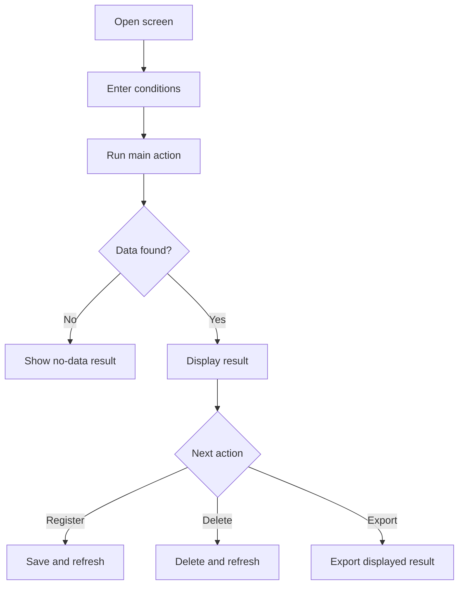

# Business Flows

> **Template.** Copy to `{{DOCS_DIR}}/Business_flows/README.md`.
>
> **For end-to-end work use `MASTER_WORKFLOW.md`, not the per-stage prompt below.** Business flow is Stage 1, the first stage after evidence exists.

Stage 1 artifact. One file per screen explaining, in business language, what the screen is for and what rules govern it — readable by someone who will never open the code.

## What Belongs Here

1. What the screen is used for, and who operates it.
2. What inputs are required before anything happens.
3. What actions the operator can take.
4. What business rules apply — validations, calculations, locks, side effects.
5. What legacy behavior differs from the new system, and what needs a decision from the business owner.

## What Does Not Belong Here

- SQL, API shapes, class names, or file paths — those belong in `Screen_plans/{screen}.md`.
- Test commands or probe queries — those belong in `Test_Instruction/{screen}.md`.
- Anything phrased so that only a developer can check it. If a reviewer who knows the business cannot confirm a statement, it is in the wrong document.

## Why This Stage Exists Before Design

Writing the business flow first forces the evidence to be read for **meaning** rather than for structure. A developer who goes straight to the screen plan tends to transcribe what the legacy code does without ever asking whether it is what the business needs — and legacy defects then get faithfully reproduced as requirements.

Gate G1 runs at the end of this stage and checks that every applicable evidence object was actually opened. That check is only meaningful if this document cites its evidence with anchors.

## Agent Prompt For One Business Flow

```text
Please create or refresh the business flow for this screen:

- screen: {screen}
- screen_key: {screen_key}
- module: {module}

Output target: {{DOCS_DIR}}/Business_flows/{screen}.md

Resolve project values from PROJECT_CONFIG.md first.

Use available evidence, per LEGACY_EVIDENCE.md for {{LEGACY_VARIANT}}:
- the exported legacy form and report for this screen, including event handlers
- sub-forms, shared modules, and queries or stored procedures the screen uses
- screenshots
- legacy output samples, when the screen produces a report, print, or export
- for split designs, the data file as well as the front-end file
- the current implementation, only to explain behavior already accepted

If the target file exists, do not treat it as the source of truth. Preserve useful reviewer notes and
prior open decisions, then reconcile against current evidence.

Workflow:
1. Identify purpose, actor, preconditions, actions, outputs, business rules, and side effects.
2. Cite an anchor for every legacy claim, in the format defined in TRACEBACK_GATES.md. A claim with
   no anchor cannot be verified by gate G1 and will be reported as a coverage gap.
3. Confirm whether the screen has report or export output, and reference the matching legacy sample.
4. Write the file using the structure in this README.
5. Keep it business-readable. No SQL, no API details, no code paths.
6. Mark ambiguous behavior as an open decision, never as confirmed behavior.
7. Update the index table in this README.

Rules:
- If exported text looks like garbage, re-read it with {{SOURCE_ENCODING}} before concluding anything
  about labels or formulas. Mojibake is not evidence of a naming convention.
- Distinguish what the evidence proves from what you inferred. Say which.
- A legacy defect is not automatically a requirement. Record it as an open decision for the business
  owner rather than silently promoting it to a rule.
- Do not invent a rule to fill a gap in the evidence. An acknowledged gap is useful; a plausible
  guess recorded as fact is not.
```

## File Naming

One file per screen: `{{DOCS_DIR}}/Business_flows/{screen}.md`, using the `screen` value from `Screens_Registry.md` verbatim.

## Required Structure

```markdown
# {screen} — Business Flow

> Last refreshed: YYYY-MM-DD · doc_mode: greenfield | backfill | refresh · By: agent | {name}

## 1. Purpose

What the screen achieves, in business terms. Two or three sentences.

## 2. Source Evidence

Every legacy object examined, with an anchor where one applies. Include the form, report, sub-forms,
shared modules, queries or procedures, screenshots, and output samples. For a split design, state
which file each item came from.

Gate G1 measures against this list, so an object examined but not listed here counts as unexamined.

## 3. Actors And Preconditions

Who uses the screen, and what must already exist before the flow can start.

## 4. Main Business Flow

One compact diagram first, then the same flow in prose. Keep the diagram to main actions, decision
points, and important side effects — field-level detail belongs in section 6.



## 5. Action Flows

One subsection per significant action — search, register, correct, delete, import, print, export.
Describe what the operator does and what they observe, including messages.

## 6. Business Rules

Required inputs, validations, locks, calculations, rounding, totals, and side effects. Number them,
because the screen plan and gate G2 refer to them by number.

## 7. Legacy Versus New System

Accepted differences, legacy defects being deliberately fixed and why, and behaviors still under
discussion. Each open item names who must decide.

## 8. Review Checklist

The concrete items a business reviewer must confirm or challenge. For a report or export screen,
include what to check in the output: layout, grouping, row count, header order, totals, signs, and
category labels.
```

## Writing Rules

1. Business language before field names. Use the operator's vocabulary — it is the requirement.
2. Anchor every legacy claim. Unanchored claims fail gate G1 and cannot be checked by anyone later.
3. Number the business rules in section 6. Unnumbered rules cannot be traced by gate G2.
4. State accepted differences plainly; never bury one inside a sentence about something else.
5. Mark unresolved behavior as an open decision, with an owner.
6. Add the diagram whenever the screen has more than one branch or a side effect.
7. Keep implementation detail out. If a sentence only makes sense to a developer, move it to the screen plan.

## Current Business Flows

| Screen | Business flow | Screen plan | Test instruction | Related output evidence |
|---|---|---|---|---|
| | | | | |

## Related Documents

| Document | Relationship |
|---|---|
| `MASTER_WORKFLOW.md` | Runs this stage; G1 closes it |
| `TRACEBACK_GATES.md` | G1 measures evidence coverage against section 2; anchor format defined there |
| `LEGACY_EVIDENCE.md` | What evidence exists for this legacy variant, and where rules hide in it |
| `Screen_plans/{screen}.md` | Downstream: turns these rules into a technical contract |
| `Code_Review/{screen}.md` | Checks implementation against the rules in section 6 |
