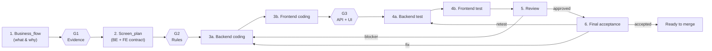

# {{PROJECT_NAME}} Documentation

> **Template.** Copy to `{{DOCS_DIR}}/README.md` and fill every `{{...}}`. This is the entry
> point a person opens first; it does not replace `MASTER_WORKFLOW.md`, it routes to it.

This folder holds all design, planning, and review documentation for **{{PROJECT_NAME}}** —
{{SUBSYSTEM_CODE}} modernized from a legacy {{LEGACY_VARIANT}} Access application into
Django REST + React.

If you are new to this folder, read this README first. It points you to the right detailed
document for what you actually need. Do not start by opening `MASTER_WORKFLOW.md` cold — it is
the operational manual, not the introduction.

## 1. Quick Start — "I want to ..."

| I want to ... | Go to |
|---|---|
| Implement a screen end-to-end | The `modernize-screen` skill, or follow `MASTER_WORKFLOW.md` directly |
| Run just one stage | The `plan-screen`, `code-screen`, `test-screen`, or `review-screen` skill |
| Check where a screen stands without starting anything | The `screen-status` skill |
| See which screens exist and their status | `Screens_Registry.md` |
| Check open bugs / decisions / Q&A | `Known_Issues.md` |
| Look up backend coding rules | `{{BACKEND_RULES_DOC}}` |
| Look up how to test a screen's backend | `BACKEND_TESTING.md` |
| Look up how to test a screen's frontend | `FRONTEND_TESTING.md` |
| Look up code style (naming, type hints, tests, logging) | `{{CONVENTIONS_DOC}}` |
| Look up DB table or field name | `{{TABLE_MAP_DOC}}` |
| Find legacy evidence (form, screenshot, report) | `{{EVIDENCE_CODE_DIR}}`, `{{EVIDENCE_UI_DIR}}`, `{{EVIDENCE_OUTPUT_DIR}}` |
| Understand the PM-facing flow for one screen | `Business_flows/{screen}.md` |
| Understand the technical design for one screen | `Screen_plans/{screen}.md` |
| See how a screen was actually implemented | `Coding_Records/{screen}.md` |
| Run or check tests for one screen | `Test_Instruction/{screen}.md` |
| See the review verdict for one screen | `Code_Review/{screen}.md` |
| See the final acceptance decision for one screen | `Final_Acceptance/{screen}.md` |
| Report a bug found for one screen | `Bug_Reports/{screen}.md`, or `Known_Issues.md` if it spans screens |

If your question is not above, open `MASTER_WORKFLOW.md` — it is the catch-all reference.

## 2. The Pipeline At A Glance

Every screen passes through six stages with three Traceback Gates (G1, G2, G3) between them.
Stages 1–5 produce the five per-screen implementation artifacts; Stage 6 records the final
acceptance recommendation and user decision in `Final_Acceptance/{screen}.md`. Each gate
verifies coverage and routes issues to `Known_Issues.md`. Stage 5 gives the review verdict;
Stage 6 decides whether the screen can be recommended for merge.

Key design choices:

- **Test runs before Review.** A reviewer needs test evidence to judge legacy parity. Reviewing on red tests is not reviewing.
- **Stages are sequential** because each consumes the previous artifact — see `MASTER_WORKFLOW.md` "Parallelism Rules" for the two bounded exceptions (backend/frontend coding when the contract is frozen; different-module screens in a batch).
- **Traceback Gates G1/G2/G3** catch coverage gaps between stages. HIGH findings block and ask; MEDIUM/LOW file to `Known_Issues.md` and continue; the Stage 5 reviewer confirms.
- **The pipeline is idempotent.** Running it again on the same screen refreshes the artifacts against current code and evidence. Prior reviewer notes are preserved.

## 3. Run Modes

A screen has **two independent tracks**, each with its own mode:

| Mode | Governs | Trigger |
|---|---|---|
| `doc_mode` | Stages 1–2 | Whether `Business_flows/{screen}.md` and `Screen_plans/{screen}.md` exist and are current |
| `be_mode` | Stages 3a, 4a | `status_be` in `Screens_Registry.md` plus presence of `Coding_Records/{screen}.md` §Backend |
| `fe_mode` | Stages 3b, 4b | `status_fe` plus presence of §Frontend |

Each resolves independently to **Greenfield** (write new), **Backfill** (document existing code
only, no new code without an explicit request), or **Refresh** (reconcile against current
code/evidence). A screen with a shipped backend and an unstarted frontend is `be_mode: Refresh,
fe_mode: Greenfield` — a normal state, not an error.

## 4. Doc Map

### Top-level (cross-cutting)

| File | Audience | Role |
|---|---|---|
| `README.md` (this file) | Everyone | Entry point and quick start |
| `MASTER_WORKFLOW.md` | Agent / tech lead | Operational manual — 6 stages, modes, parallelism, cleanup |
| `TRACEBACK_GATES.md` | Agent / reviewer | Full gate spec — severity ladder, classification, anchor format |
| `LEGACY_EVIDENCE.md` | Agent | Evidence taxonomy for `{{LEGACY_VARIANT}}`, Stage 0 handoff contract |
| `PROJECT_CONFIG.md` | Everyone | Every project-specific value the pipeline resolves |
| `ARCHITECTURE.md` | Everyone | Fixed architecture and scope boundary — non-negotiable |
| `Screens_Registry.md` | Everyone | Screen ↔ key ↔ module ↔ priority ↔ status |
| `Known_Issues.md` | Everyone | Cross-screen bugs, decisions, Q&A log |
| `Known_Issues_Archive.md` | Everyone | Closed rows aged out of the active log |
| `{{TABLE_MAP_DOC}}` | Developer | DB schema, table and field names |

### Per-screen folders (stage-by-stage artifacts)

| Folder | Stage | Audience | Per-screen file role |
|---|---|---|---|
| `Business_flows/` | 1 | PM / reviewer | What & why, business rules, open decisions |
| `Screen_plans/` | 2 | Developer / reviewer | Legacy evidence, backend + frontend contract, gap matrix |
| `Coding_Records/` | 3a/3b | Developer / reviewer | Files touched, decisions, deviations, Q&A |
| `Test_Instruction/` | 4a/4b | QA / developer | Test commands, coverage, parity validation |
| `Code_Review/` | 5 | Reviewer / tech lead | Verdict and findings |
| `Final_Acceptance/` | 6 | Tech lead / user | Recommendation, user decision, merge gate |
| `Bug_Reports/` | any | Developer / QA | Per-screen bugs found during coding, test, or review |

### Cross-cutting rule documents

| Document | Role |
|---|---|
| `{{BACKEND_RULES_DOC}}` | Backend coding rules — read at Stage 3a |
| `{{FRONTEND_RULES_DOC}}` | Frontend coding rules — read at Stage 3b |
| `BACKEND_TESTING.md` | Backend test method — read at Stage 4a |
| `FRONTEND_TESTING.md` | Frontend test method — read at Stage 4b |
| `{{CONVENTIONS_DOC}}` | Language-level style |
| `{{EVIDENCE_CODE_DIR}}` / `{{EVIDENCE_UI_DIR}}` / `{{EVIDENCE_OUTPUT_DIR}}` | Raw legacy evidence |
| `{{API_COLLECTION_DIR}}` | QA handoff artifacts, or `n/a` |

## 5. Common Commands

### Single screen, end-to-end

Invoke the `modernize-screen` skill, or describe the goal directly — "implement screen
{screen}", "refresh the pipeline for {screen}". The agent reads `MASTER_WORKFLOW.md`, runs
Pre-Flight, resolves all three modes, and executes the stages each mode calls for.

### Single stage

Each row is a skill — invoke it by name, by its `/ak:<name>` slash form in Claude Code, or
by describing the request in plain language.

| Skill | Stages | Refuses without |
|---|---|---|
| `plan-screen` | 1–2 | (nothing upstream to check beyond evidence) |
| `code-screen` | 3a–3b | a two-contract screen plan with a populated gap matrix |
| `test-screen` | 4a–4b | a coding record for the track being tested |
| `review-screen` | 5 | (reviews whatever upstream artifacts exist, and says what's missing) |
| `screen-status` | none — read-only | nothing; always safe to run |

### Multiple screens in parallel

Describe the batch directly — "implement {screen1} and {screen2} in parallel". The agent
partitions by module (`orchestration/parallelism.json`), dispatches one group agent per module
group with an envelope from `templates/group-task-envelope.json`, and aggregates the per-screen
handoffs. See `MASTER_WORKFLOW.md` §"Multi-Screen Batch".

### Adding a new screen

You do not need to edit `Screens_Registry.md` by hand. When you ask the agent to work on a
screen that is not in the registry, it runs **Agent-Assisted Registration**: detects
`screen_key`, `module`, priority, and status from evidence and existing code, proposes a row,
and waits for `ok`, `edit field=value`, or `cancel`. Full flow in `MASTER_WORKFLOW.md`
§"Agent-Assisted Registration".

Edit the registry by hand only when adding a screen **proactively to future scope** during
release planning — a human scope decision, not a per-invocation task.

## 6. Who Answers Which Question

| Question type | Owner | Where it gets recorded |
|---|---|---|
| "What should this screen do for the business?" | PM | `Business_flows/{screen}.md` open decisions |
| "Is the legacy behavior intentional or a bug?" | PM | `Business_flows/{screen}.md` legacy vs new notes |
| "Which model owns this table?" | Tech lead (cross-subsystem) | `Known_Issues.md` (type `data`) |
| "Should this be ORM or raw SQL?" | Tech lead | `Screen_plans/{screen}.md` gap matrix |
| "Is this change safe for final acceptance?" | Reviewer | `Code_Review/{screen}.md` verdict |
| "Is this screen ready to merge?" | Tech lead / user | `Final_Acceptance/{screen}.md` user decision |
| "Why does the test suite fail?" | Developer + tech lead | `Coding_Records/{screen}.md`, promote to `Known_Issues.md` if cross-screen |
| "What does this artifact mean?" | Anyone | This README, then `MASTER_WORKFLOW.md` |

## 7. Current Status

For live status, open `Screens_Registry.md`. Refresh the snapshot below by hand when it goes
stale — nothing keeps it in sync automatically.

- **Active screens:** {{fill: count}}
- **Future scope:** {{fill: count, or "none"}}
- **Modules touched:** {{fill: list}}
- **Known backlog:** {{fill: what's outstanding across most screens, or "none"}}

For known cross-screen issues, open `Known_Issues.md`.

## 8. Rules That Cannot Be Skipped

1. **Always read `MASTER_WORKFLOW.md` before starting end-to-end work.** Per-folder READMEs and the single-stage commands are stage-only.
2. **Always look up the screen in `Screens_Registry.md` first.** If absent, run Agent-Assisted Registration rather than guessing.
3. **When `{{MIGRATIONS_POLICY}}` is `external`, never create a model or migration here.** Import from the owning module; if a needed field exists nowhere, stop and follow `{{MISSING_MODEL_ESCALATION}}`.
4. **Never mutate a reference or read-only database.** Read-only probes only, per `{{REFERENCE_DB_POLICY}}`.
5. **Never write code in Backfill mode without an explicit request.** Backfill produces documentation only.
6. **Never close a `Known_Issues.md` row without naming what resolved it.**
7. **Test before Review, and Review before Acceptance.** Stage 4 must gate green (or `legacy_parity_blocked` with a reason) before Stage 5; Stage 6 cannot accept before Stage 5 approves.
8. **Never set `status_be` or `status_fe` to `verified` outside the Stage 5 verdict.** `implemented` means code exists; `verified` means review approved it. Conflating them makes the pipeline pick Refresh mode and skip the checks that would have found the gap.
9. **Update `Screens_Registry.md` and `Known_Issues.md` only at the Update Gates** defined in `MASTER_WORKFLOW.md` — never mid-stage, never by two writers at once.

For the full rule set, see `MASTER_WORKFLOW.md` and `{{BACKEND_RULES_DOC}}`.
